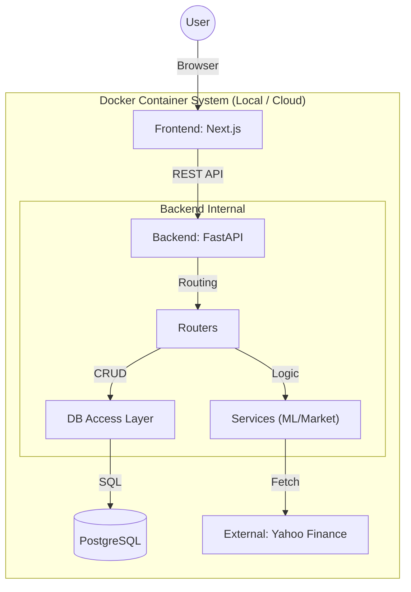

# AST-Web: Stock Trading Support System (Cloud Native Migration)

## 📖 プロジェクト概要
**AST-Web** は、過去にPython/Tkinterで開発したデスクトップ型株式売買支援システムを、モダンなWebアーキテクチャ（Cloud Native）へ移行・再構築するプロジェクトです。

本プロジェクトの目的は、単なるアプリのWeb化にとどまらず、**モノリスからマイクロサービスへの移行、コンテナオーケストレーション（Kubernetes）、GitOpsの実践** を通じて、堅牢かつスケーラブルなシステム基盤を構築するプロセスそのものを実証することにあります。

現在は **Phase 1 (MVP)** として、**DockerコンテナベースのWebアプリケーション（FastAPI + Next.js）** を構築し、AWSクラウド（Serverless/Container）へデプロイ可能な構成を実現しています。

---

## 📺 動作デモ
https://github.com/user-attachments/assets/37e2d080-890b-4a8c-bc28-46ec11759a0d

---

## 🏗 アーキテクチャ (Phase 1)

**「責務の分離 (Separation of Concerns)」** を徹底し、フロントエンドとバックエンドを疎結合に保っています。バックエンド内部はレイヤーアーキテクチャを採用し、将来的なマイクロサービス化（Phase 2）に備えています。



### 採用技術スタック

| Category | Tech Stack | Description |
| :--- | :--- | :--- |
| **Frontend** | **Next.js (App Router)** | Reactベースのフレームワーク。TypeScriptによる型安全性とコンポーネント指向UIを実現。 |
| **Styling** | **Tailwind CSS** | ユーティリティファーストなCSS設計。`next-themes` によるダークモード対応済み。 |
| **Backend** | **Python (FastAPI)** | 非同期処理に強く、Pydanticによる厳格な型定義が可能。AWS Lambda用アダプタ(Mangum)実装済み。 |
| **ML / Analysis** | **XGBoost / Pandas** | 過去1年分の株価データを分析し、翌日の騰落予測（Up/Down）を行う機械学習エンジン。 |
| **Database** | **PostgreSQL** | **Local**: Docker Container (postgres:15-alpine)<br>**Prod**: Amazon RDS (Planned) |
| **Infrastructure** | **Docker / Compose** | フルスタック環境のコンテナ化。ボリュームマウントによるデータ永続化とホットリロード対応。 |

---

## 📂 ディレクトリ構成と役割

コードベースは **Monorepo構成** を採用し、フロントエンドとバックエンドを一元管理しています。

### Backend (`/backend`)
ビジネスロジックの中核です。MVCに近い構成で責務を分割しています。

```text
backend/
├── main.py                # エントリーポイント (App初期化, Router登録)
├── schemas.py             # Pydanticモデル (APIリクエスト/レスポンスの型定義)
├── db/                    # データアクセス層
│   ├── database.py        # DB接続設定 (SQLAlchemy)
│   ├── models.py          # DBテーブル定義
│   └── crud.py            # SQLクエリ実行・バリデーションロジック
├── routers/               # コントローラー層 (エンドポイント定義)
│   ├── stocks.py          # 銘柄管理 (CRUD) API
│   └── analysis.py        # AI分析・シミュレーション実行 API
└── services/              # ビジネスロジック層 (外部API・計算)
    ├── market_data.py     # 株価データ取得・整形・エラーハンドリング
    └── ml_engine.py       # 機械学習モデル (XGBoost) による推論ロジック
```

### Frontend (`/frontend`)
ユーザーインターフェースです。ロジックをHooksに分離し、Viewを純粋に保っています。

```text
frontend/
├── app/                   # Next.js App Router (Layout, Page)
├── components/            # UIコンポーネント
│   ├── StockInputForm.tsx # 銘柄登録フォーム (東証限定バリデーション)
│   ├── AnalysisPanel.tsx  # 一括分析実行・プログレス可視化
│   ├── StockTable.tsx     # 銘柄一覧・分析結果表示テーブル
│   ├── StatusLog.tsx      # システム処理ログビューア
│   ├── ThemeToggle.tsx    # ダークモード切り替えボタン
│   └── ThemeProvider.tsx  # テーマコンテキストプロバイダー
├── hooks/                 # カスタムフック
│   └── useStocks.ts       # API通信・状態管理ロジックの集約
├── lib/
│   └── api.ts             # 共通APIクライアント (Fetch wrapper)
└── types/                 # TypeScript型定義 (Backendモデルと同期)
    └── index.ts           # APIレスポンス・リクエスト型
```

---

## 🚀 動作環境の構築 (Getting Started)

Docker Desktopがインストールされている環境であれば、以下のコマンドのみでローカル環境を構築できます。

### 1. リポジトリのクローン
```bash
git clone https://github.com/[your-username]/ast-web.git
cd ast-web
```

### 2. コンテナの起動
バックエンド(FastAPI)、フロントエンド(Next.js)、データベース(PostgreSQL)が一括で起動します。

```bash
docker compose up --build
```

### 3. アクセス
*   **Webアプリ**: [http://localhost:3000](http://localhost:3000)
*   **APIドキュメント (Swagger UI)**: [http://localhost:8000/docs](http://localhost:8000/docs)
    *   APIのテスト実行やレスポンス確認が可能です。

### 4. データベースの確認 (Optional)
コンテナ内のPostgreSQLに直接アクセスする場合：
```bash
docker exec -it stock-db psql -U user -d stock_db
```

---

## ✨ 実装済み機能 (Phase 1)

1.  **銘柄管理 (CRUD)**
    *   **東証(.T)限定**: データの信頼性を担保するため、東京証券取引所の銘柄のみ登録可能。
    *   **バリデーション**: `yfinance` APIを用いて実在する銘柄かチェックし、不正なコードの登録を防止。
2.  **AI投資判断 (On-Demand Analysis)**
    *   **一括分析機能**: 登録全銘柄に対して順次分析を実行。プログレスバーで進捗を可視化。
    *   **分析ロジック**: 過去データをリアルタイム取得し、XGBoostで翌日の騰落を予測。保有状況に応じて「BUY/SELL/STAY/WAIT」を提案。
    *   **データ永続化**: 分析結果（予測・現在株価・提案）をDBに保存し、次回アクセス時に即時表示。
3.  **可観測性 (Observability)**
    *   **システムログ**: バックエンドとの通信状況やエラー詳細をフロントエンド上のログパネルにリアルタイム表示。
4.  **UI/UX**
    *   **Responsive**: PC/タブレット/SPに対応したレスポンシブデザイン。

---

## 🗺 ロードマップ

本プロジェクトは段階的な進化を予定しています。

*   **Phase 1: AWS Serverless Environment (Current)**
    *   [x] PythonデスクトップアプリのWeb API化 (FastAPI)
    *   [x] Next.jsによるモダンUI構築
    *   [x] Docker Composeによるフルスタック開発環境
    *   [x] AI推論エンジンの移植とDB永続化の実装
    *   [x] AWSへのデプロイ (Lambda / Amplify / RDS)
*   **Phase 2: Local Microservices Refactoring**
    *   [ ] バックエンドをドメインごと（Core, ML, Data）にマイクロサービス分割
    *   [ ] Redisによるキャッシュ層の導入 (yfinanceの負荷軽減)
*   **Phase 3: AWS Cloud Native (EKS & GitOps)**
    *   [ ] Amazon EKS へのデプロイ
    *   [ ] Istio (Service Mesh) による通信制御と可視化
    *   [ ] ArgoCDによるGitOpsフローの構築

---

## 👤 Author
*   **Role**: Infrastructure Engineer / Aspiring Web Developer
*   **Focus**: Cloud Native, DevOps, SRE