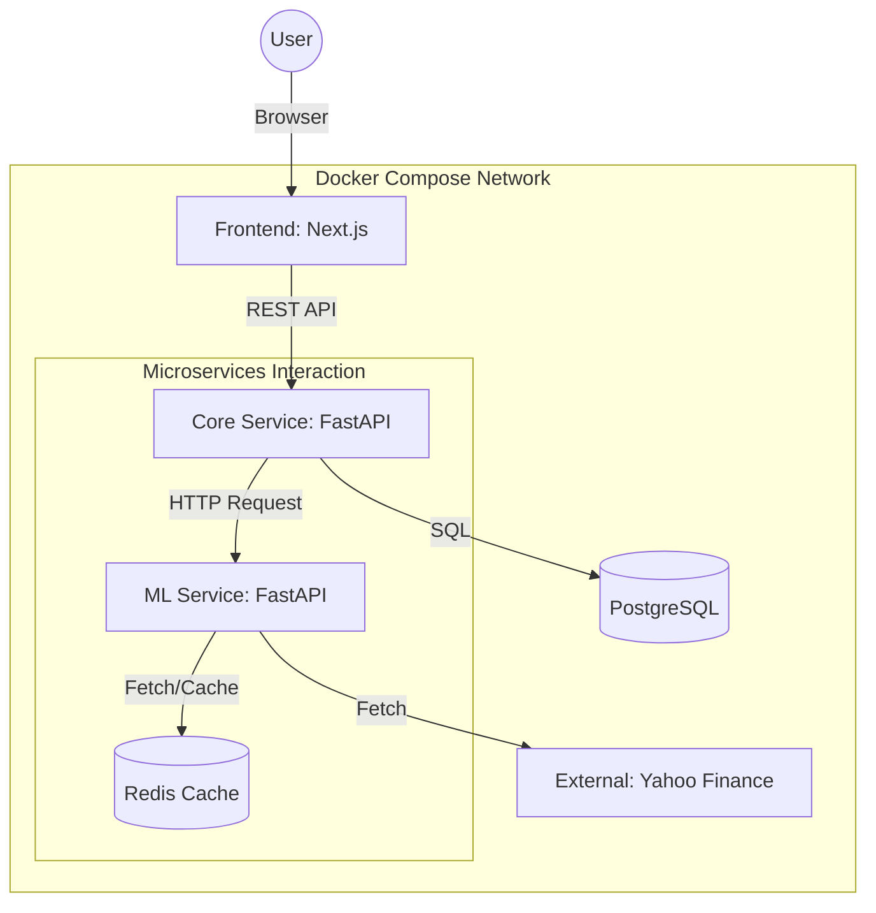

# AST-Web: Stock Trading Support System (Phase 2)

## 📖 プロジェクト概要
**AST-Web** は、作者が大学生時代にPython/Tkinterで開発した機械学習株式売買支援システム（Windowsアプリ）を、
モダンなWebアーキテクチャ（Cloud Native）へ移行・再構築するプロジェクトです。

本プロジェクトの目的は、単なるアプリのWeb化にとどまらず、**モノリスからマイクロサービスへの移行、コンテナオーケストレーション、GitOpsの実践** を通じて、堅牢かつスケーラブルなシステム基盤を構築するプロセスそのものを実証することにあります。

### 🔄 Phase 2: Microservices Refactoring
Phase 1では単一のコンテナで動作していたバックエンドを分割しました。
現在は **Core Service**（Web API・DB管理）と **ML Service**（数値計算・データ取得）によるマイクロサービス構成へ移行し、**Redis** によるキャッシュ戦略の導入を進めています。

---

## 🏗 アーキテクチャ (Phase 2)

**「責務の分離 (Separation of Concerns)」** を物理的なコンテナレベルで実現しました。
Webサーバーの応答性（Core）と、重い機械学習処理（ML）を分離することで、将来的なスケーラビリティを確保しています。



### 採用技術スタック (Phase 2 Update)

| Category | Service | Tech Stack | Description |
| :--- | :--- | :--- | :--- |
| **Frontend** | **Web UI** | **Next.js (App Router)** | TypeScriptによる型安全性とコンポーネント指向UI。Phase 1から継続。 |
| **Backend** | **Core Service** | **FastAPI (Python)** | **Port: 8000**. API Gateway的役割。DB操作、ユーザーリクエストのハンドリングを担当。 |
| **Backend** | **ML Service** | **FastAPI (Python)** | **Port: 8001**. 計算・分析専用のマイクロサービス。XGBoostによる推論を実行。 |
| **Cache** | **Redis** | **Redis 7** | **New**. 株価データのキャッシュ層。外部APIへの負荷軽減とレスポンス高速化を実現。 |
| **Database** | **DB** | **PostgreSQL 15** | 売買履歴、分析結果、銘柄情報の永続化。 |
| **Infra** | **Orchestration** | **Docker Compose** | 複数コンテナ (`stock-core`, `stock-ml`, `stock-db`, `redis`) の一括管理。 |

---

## 📂 ディレクトリ構成と役割

マイクロサービス化に伴い、ルート直下の構成を分割しましたが、Monorepo構成は維持しています。

```text
ast-web/
├── docker-compose.yml     # 全サービスのオーケストレーション定義
├── backend/               # [Core Service] 銘柄管理・DB操作・API Gateway
│   ├── main.py            # エントリーポイント (Port 8000)
│   ├── schemas.py         # 共通データモデル (Pydantic)
│   ├── db/                # DB接続・モデル定義
│   └── routers/           # コントローラー
│       ├── stocks.py      # 銘柄CRUD
│       └── analysis.py    # 分析オーケストレーター (ML Serviceを呼び出す)
├── backend-ml/            # [ML Service] 計算・データ取得 (New!)
│   ├── main.py            # 分析APIエントリーポイント (Port 8001)
│   ├── Dockerfile         # 計算用ライブラリ(scikit-learn等)を含むビルド定義
│   └── services/          # ビジネスロジック層
│       ├── market_data.py # 株価データ取得 (Redisキャッシュ制御)
│       └── ml_engine.py   # 機械学習モデル (XGBoost) による推論
└── frontend/              # [Frontend] Next.js アプリケーション
    ├── app/               # App Router Pages
    ├── components/        # UI Components (AnalysisPanel, StockTable...)
    ├── lib/               # API Client (Core Serviceへの接続)
    └── types/             # TypeScript型定義
```

---

## 🚀 動作環境の構築 (Getting Started)

マイクロサービス構成のため、複数のコンテナが連携して動作します。

### 1. リポジトリのクローン
```bash
git clone https://github.com/[your-username]/ast-web.git
cd ast-web
```

### 2. コンテナの起動
以下のコマンドで、全サービス（Core, ML, DB, Redis）が一括起動します。
Phase 1のコンテナが残っている場合は、競合を避けるため `docker compose down` してから実行してください。

```bash
docker compose up --build
```

### 3. アクセス
*   **Webアプリ**: [http://localhost:3000](http://localhost:3000)
*   **Core API Docs (Swagger UI)**: [http://localhost:8000/docs](http://localhost:8000/docs)
    *   メインのAPIエンドポイント確認用。
*   **ML API Docs (Swagger UI)**: [http://localhost:8001/docs](http://localhost:8001/docs)
    *   計算サービスの単体動作確認用。

### 4. 動作確認
Webアプリ上で「一括分析」ボタンを押すと、Frontend -> Core -> ML -> Core -> DB -> Frontend のフローでデータが流れ、ログパネルに連携状況が表示されます。

---

## ✨ 実装済み機能 (Phase 2 Update)

1.  **マイクロサービス連携**
    *   **Core Service**: ユーザー管理、保有銘柄のCRUD、売買判断の最終決定。
    *   **ML Service**: 株価データの取得、XGBoostによる騰落予測。
    *   **連携ログ**: フロントエンド上で「CoreからMLへリクエスト送信中...」といった詳細な処理状況を可視化。
2.  **データ整合性の向上**
    *   **浮動小数点数対策**: バックエンド/フロントエンド双方で適切な丸め処理を行い、正確な価格情報を表示・保存。
3.  **パフォーマンス最適化**
    *   **Redisキャッシュ**: 頻繁な外部APIアクセスを抑制し、2回目以降の分析を高速化（実装中）。

---

## 🗺 ロードマップ

本プロジェクトは段階的な進化を予定しています。

*   **Phase 1: Monolithic MVP (Completed)**
    *   [x] PythonデスクトップアプリのWeb API化 (FastAPI)
    *   [x] Next.jsによるモダンUI構築
    *   [x] Docker Composeによるフルスタック開発環境
*   **Phase 2: Microservices & Optimization (Current)**
    *   [x] バックエンドの分割 (Core Service / ML Service)
    *   [x] サービス間通信の実装 (HTTPX)
    *   [ ] Redisによるキャッシュ層の導入 (Rate Limit回避・高速化)
    *   [ ] 生成AI (LLM) 連携によるニュース分析機能のプロトタイピング
*   **Phase 3: Cloud Native & GitOps (Planned)**
    *   [ ] Kubernetes (EKS/GKE) へのデプロイ
    *   [ ] ArgoCDによるGitOpsフローの構築
    *   [ ] サービスメッシュ (Istio) による可観測性向上

---

## 👤 Author
*   **Role**: Infrastructure Engineer / Aspiring Web Developer
*   **Focus**: Cloud Native, DevOps, SRE