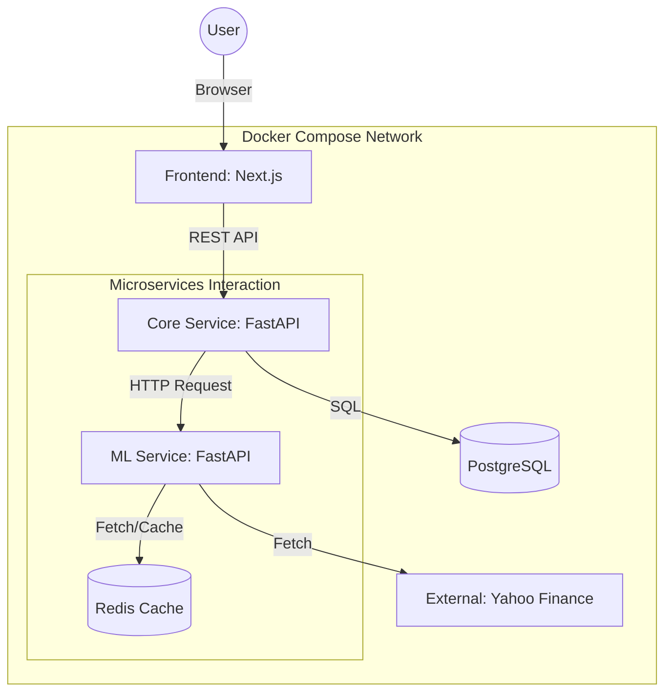

# AST-Web: Stock Trading Support System (Phase 2)

## 📖 プロジェクト概要
**AST-Web** は、作者が大学生時代にPython/Tkinterで開発した機械学習株式売買支援システム（Windowsアプリ）を、
モダンなWebアーキテクチャ（Cloud Native）へ移行・再構築するプロジェクトです。

本プロジェクトの目的は、単なるアプリのWeb化にとどまらず、**モノリスからマイクロサービスへの移行、コンテナオーケストレーション、GitOpsの実践** を通じて、堅牢かつスケーラブルなシステム基盤を構築するプロセスそのものを実証することにあります。

### 🔄 Phase 2: Microservices Refactoring
Phase 1では単一のコンテナで動作していたバックエンドを分割しました。
現在は **Core Service**（Web API・DB管理）と **ML Service**（数値計算・データ取得）によるマイクロサービス構成へ移行し、**Redis** によるキャッシュ戦略の導入を進めています。

---

## 📺 動作デモ
https://github.com/user-attachments/assets/37e2d080-890b-4a8c-bc28-46ec11759a0d

---

## 🏗 アーキテクチャ (Phase 2)

**「責務の分離 (Separation of Concerns)」** を物理的なコンテナレベルで実現しました。
Webサーバーの応答性（Core）と、重い機械学習処理（ML）を分離することで、将来的なスケーラビリティを確保しています。


```mermaid
graph TD
    User((User)) -->|Browser| Front[Frontend: Next.js]
    
    subgraph "Docker Compose Network"
        Front -->|REST API| Core[Core Service: FastAPI]
        
        subgraph "Microservices Interaction"
            Core -->|HTTP Request| ML[ML Service: FastAPI]
            ML -->|Fetch/Cache| Redis[(Redis Cache)]
        end
        
        Core -->|SQL| DB[(PostgreSQL)]
        ML -->|Fetch| Yahoo[External: Yahoo Finance]
    end
```

### 採用技術スタック (Phase 2 Update)

| Category | Service | Tech Stack | Description |
| :--- | :--- | :--- | :--- |
| **Frontend** | **Web UI** | **Next.js (App Router)** | TypeScriptによる型安全性とコンポーネント指向UI。Phase 1から継続。 |
| **Backend** | **Core Service** | **FastAPI (Python)** | **Port: 8000**. API Gateway的役割。DB操作、ユーザーリクエストのハンドリングを担当。 |
| **Backend** | **ML Service** | **FastAPI (Python)** | **Port: 8001**. 計算・分析専用のマイクロサービス。XGBoostによる推論を実行。 |
| **Cache** | **Redis** | **Redis 7** | **New**. 株価データのキャッシュ層。外部APIへの負荷軽減とレスポンス高速化を実現。 |
| **Database** | **DB** | **PostgreSQL 15** | 売買履歴、分析結果、銘柄情報の永続化。 |
| **Infra** | **Orchestration** | **Docker Compose** | 複数コンテナ (`stock-core`, `stock-ml`, `stock-db`, `redis`) の一括管理。 |

---

## 📂 ディレクトリ構成と役割

マイクロサービス化に伴い、ルート直下の構成を分割しましたが、Monorepo構成は維持しています。

```text
ast-web/
├── docker-compose.yml          # 全サービスのオーケストレーション定義
├── .github/workflows/test.yml  # CI: backend / ml / frontend の3並行ジョブ
│
├── backend/                    # [Core Service] 銘柄管理・DB操作・API Gateway
│   ├── main.py                 # エントリーポイント (Port 8000)
│   ├── schemas.py              # 共通データモデル (Pydantic)
│   ├── db/                     # DB接続・モデル定義
│   ├── routers/
│   │   ├── stocks.py           # 銘柄CRUD
│   │   └── analysis.py         # 分析オーケストレーター (ML Serviceを呼び出す)
│   └── tests/
│       ├── conftest.py         # SQLite in-memory DB fixture・TestClient DI
│       └── unit/
│           ├── test_stocks_router.py   # CRUD・バリデーション (18テスト)
│           └── test_analysis_logic.py  # 売買判断ロジック全パターン (14テスト)
│
├── backend-ml/                 # [ML Service] 計算・データ取得
│   ├── main.py                 # 分析APIエントリーポイント (Port 8001)
│   ├── services/
│   │   ├── market_data.py      # 株価データ取得 (yfinance・リトライ制御)
│   │   ├── ml_engine.py        # XGBoost による騰落予測
│   │   └── cache.py            # Redis キャッシュ (Graceful Degradation)
│   └── tests/
│       ├── conftest.py
│       └── unit/
│           ├── test_predict_endpoint.py # /predict エンドポイント全フロー (14テスト)
│           ├── test_ml_engine.py        # XGBoost予測ロジック (8テスト)
│           ├── test_market_data.py      # yfinanceラッパー (8テスト)
│           └── test_cache.py            # Redis操作・障害時Degradation (15テスト)
│
└── frontend/                   # [Frontend] Next.js アプリケーション
    ├── app/                    # App Router Pages
    ├── components/             # UI Components
    ├── hooks/                  # useStocks カスタムフック
    ├── lib/                    # API Client
    ├── types/                  # TypeScript型定義
    └── __tests__/
        ├── page.test.tsx
        ├── components/
        │   └── StockInputForm.test.tsx  # バリデーション・操作 (9テスト)
        ├── hooks/
        │   └── useStocks.test.ts        # フックの状態管理 (10テスト)
        └── lib/
            └── api.test.ts              # APIクライアント (7テスト)
```

---

## 🚀 動作環境の構築 (Getting Started)

マイクロサービス構成のため、複数のコンテナが連携して動作します。

### 1. リポジトリのクローン
```bash
git clone https://github.com/[your-username]/ast-web.git
cd ast-web
```

### 2. コンテナの起動
以下のコマンドで、全サービス（Core, ML, DB, Redis）が一括起動します。
Phase 1のコンテナが残っている場合は、競合を避けるため `docker compose down` してから実行してください。

```bash
docker compose up --build
```

### 3. アクセス
*   **Webアプリ**: [http://localhost:3000](http://localhost:3000)
*   **Core API Docs (Swagger UI)**: [http://localhost:8000/docs](http://localhost:8000/docs)
    *   メインのAPIエンドポイント確認用。
*   **ML API Docs (Swagger UI)**: [http://localhost:8001/docs](http://localhost:8001/docs)
    *   計算サービスの単体動作確認用。

### 4. 動作確認
Webアプリ上で「一括分析」ボタンを押すと、Frontend -> Core -> ML -> Core -> DB -> Frontend のフローでデータが流れ、ログパネルに連携状況が表示されます。

### 5. テストの実行

各サービスのテストは Docker 不要でローカル実行できます。

```bash
# Core Service (SQLiteで外部DB不要)
DATABASE_URL="sqlite:///./test.db" pytest backend/tests/ -v

# ML Service
pytest backend-ml/tests/ -v

# Frontend
cd frontend && npm test
```

---

## ✨ 実装済み機能 (Phase 2 Update)

1.  **マイクロサービス連携**
    *   **Core Service**: ユーザー管理、保有銘柄のCRUD、売買判断の最終決定。
    *   **ML Service**: 株価データの取得、XGBoostによる騰落予測。
    *   **連携ログ**: フロントエンド上で「CoreからMLへリクエスト送信中...」といった詳細な処理状況を可視化。
2.  **データ整合性の向上**
    *   **浮動小数点数対策**: バックエンド/フロントエンド双方で適切な丸め処理を行い、正確な価格情報を表示・保存。
3.  **パフォーマンス最適化**
    *   **Redisキャッシュ**: 頻繁な外部APIアクセスを抑制し、2回目以降の分析を高速化（実装中）。

---

## 🧪 テスト戦略 & 品質保証ロードマップ

### 設計思想: MECE なテストケース網羅

テストケース設計において **MECE (Mutually Exclusive, Collectively Exhaustive)** を原則とし、「漏れなし・重複なし」の網羅性を定量的に追求しています。

網羅性を測る指標は3階層で捉えています。

| 指標 | 何を測るか | 本プロジェクトでの位置づけ |
| :--- | :--- | :--- |
| **Line Coverage** | 実行された行の割合 | ベースライン確認 |
| **Branch Coverage** | if/else 全分岐の検証 | 主要KPI（現在測定中） |
| **Mutation Testing** | バグを埋め込んでテストが検知できるか | Phase D 完了後に導入 |

Branch Coverage が Line Coverage より厳しい理由: `if A and B:` という1行コードでも「A=True/B=False」「A=False/B=True」など分岐ごとにテストが要求されます。行が実行されただけではロジックの正確性は保証されません。

---

### 現在のテスト構成（158テスト）

| サービス | テストファイル | テスト数 | Line Coverage | Branch Coverage |
| :--- | :--- | :---: | :---: | :---: |
| **Core Service** | `test_stocks_router.py` / `test_analysis_logic.py` / `test_main.py` | 38 | 96% | 96% |
| **ML Service** | `test_predict_endpoint.py` / `test_ml_engine.py` / `test_market_data.py` / `test_cache.py` / `test_main.py` | 46 | **100%** | **100%** |
| **Frontend** | `StockInputForm.test.tsx` / `useStocks.test.ts` / `api.test.ts` / `page.test.tsx` / `StockTable.test.tsx` / `AnalysisPanel.test.tsx` / `StatusLog.test.tsx` | 74 | 79% | **85%** |

---

### テスト設計の技術的ポイント

**Core Service (pytest)**

- テスト専用 SQLite in-memory DB を使用し、外部 PostgreSQL なしで CI 実行可能
- `conftest.py` でトランザクション単位のロールバック fixture を実装 → テスト間の状態汚染ゼロ
- `_insert_stock()` ヘルパーで DB に直接テストデータを挿入し、API 経由で状態変化を検証
- `yfinance` / `httpx` (ML Service 間通信) を `unittest.mock` でモック化し、純粋なビジネスロジックを隔離
- async context manager (`async with httpx.AsyncClient()`) のモックパターンを実装

```
売買判断ロジックの全分岐カバー例:
  未保有 × 上昇予測  → BUY
  未保有 × 下落予測  → STAY
  保有中 × 上昇予測  → HOLD
  保有中 × 下落予測  → SELL
  売却済3日以内 × 上昇予測 → WAIT  ← 再購入禁止期間ロジック
  売却済4日後   × 上昇予測 → BUY   ← 禁止期間外
```

**ML Service (pytest)**

- yfinance・Redis を全モック化 → ネットワーク通信なしで完全再現性
- XGBoost 予測テストは実際のモデル学習を実行しつつ純粋関数として検証
  - 純粋上昇/下降トレンドだと `y_train` が単一クラスになり `XGBClassifier` が `ValueError` を投げる問題を特定し、トレンド内に意図的な逆方向日を挿入するテストデータ設計で解決
- Graceful Degradation を明示的にテスト: Redis 障害時に例外を上位に伝播させないことを verify

```
キャッシュの全ケースカバー例:
  _get_client: 接続成功 / from_url例外 / ping例外
  get_prediction: HIT / MISS / Redis停止 / GET例外 / JSONデシリアライズ正確性
  set_prediction: key形式 / TTL定数 / JSON直列化 / Redis停止 / SET例外
```

**Frontend (Jest + React Testing Library)**

- `@testing-library/react` の `renderHook` / `fireEvent` / `waitFor` を活用
- `apiClient` をモック化しネットワーク不要なオフライン実行
- カスタムフック `useStocks` を Presentation Component から独立させ単体テスト
- バリデーションロジック（空入力・英字入力・API失敗後の入力フォーム非クリア）を網羅

```
StockTable の全分岐カバー例:
  loading=true / stocks=0 件  → ローディング表示
  loading=true / stocks=1 件+ → テーブル表示（early return をすり抜ける境界ケース）
  ai_prediction: "up" / "down" / null
  ai_suggestion: BUY(赤) / SELL(緑) / WAIT(黄) / その他(グレー) / null
  current_price: 値あり → "¥{price}" / null → "---"
  order_datetime: "未取得" → "未保有" / それ以外 → 日時表示

AnalysisPanel の全分岐カバー例:
  stocks=0 件  → ボタン disabled
  stocks=1 件+ → ボタン enabled / 分析中は「連携処理中...」+ プログレスバー表示
  API 成功     → current_price を toFixed(1) でフォーマットしてログ出力
  API 例外     → [Error] ログ / onAnalysisComplete は例外後も必ず呼ばれること
```

---

### 品質向上ロードマップ

| Phase | 対象 | 追加テスト数 | カバレッジ目標 | 状態 |
| :--- | :--- | :---: | :--- | :---: |
| **Phase A** | ML Service: `/predict` エンドポイント全フロー + Redis キャッシュ全操作 | +29 | ML: 78% → **100%** | ✅ 完了 |
| **Phase B** | Frontend: `StockTable` / `AnalysisPanel` / `StatusLog` コンポーネント | +42 | Frontend: 37% → **85%**（目標 65% を大幅超過） | ✅ 完了 |
| **Phase C** | Core Service: `crud.py` / `analysis.py` の Branch Coverage 補完 | +5 | Core: 96% → **98%** | 🔲 未着手 |
| **Phase D** | Frontend: 残存コンポーネント + Mutation Testing (`mutmut` / `Stryker`) 導入 | +6 | Frontend: 85% → **90%** | 🔲 未着手 |

**Mutation Testing の導入タイミングについて:**
Branch Coverage が全サービス 95%+ に達してから導入します。それ以前は未カバーの行が多すぎてノイズになるためです。Python には `mutmut`、TypeScript/Next.js には `@stryker-mutator/core` を想定しています。

---

## 🗺 ロードマップ

本プロジェクトは段階的な進化を予定しています。

*   **Phase 1: Monolithic MVP (Completed)**
    *   [x] PythonデスクトップアプリのWeb API化 (FastAPI)
    *   [x] Next.jsによるモダンUI構築
    *   [x] Docker Composeによるフルスタック開発環境
*   **Phase 2: Microservices & Optimization (Current)**
    *   [x] バックエンドの分割 (Core Service / ML Service)
    *   [x] サービス間通信の実装 (HTTPX)
    *   [x] Redisによるキャッシュ層の導入 (Rate Limit回避・高速化)
    *   [x] GitHub Actions CI の構築 (3並行ジョブ)
    *   [ ] 生成AI (LLM) 連携によるニュース分析機能のプロトタイピング
*   **Quality: テストカバレッジ向上プロジェクト (In Progress)**
    *   [x] Phase A: ML Service 全テスト (100% branch coverage 達成)
    *   [x] Phase B: Frontend コンポーネントテスト (branch coverage 85% 達成)
    *   [ ] Phase C: Core Service branch coverage 補完 (目標 98%)
    *   [ ] Phase D: 残存コンポーネント + Mutation Testing 導入
*   **Phase 3: Cloud Native & GitOps (Planned)**
    *   [ ] Kubernetes (EKS/GKE) へのデプロイ
    *   [ ] ArgoCDによるGitOpsフローの構築
    *   [ ] サービスメッシュ (Istio) による可観測性向上

---

## 👤 Author
*   **Role**: Infrastructure Engineer / Aspiring Web Developer
*   **Focus**: Cloud Native, DevOps, SRE
