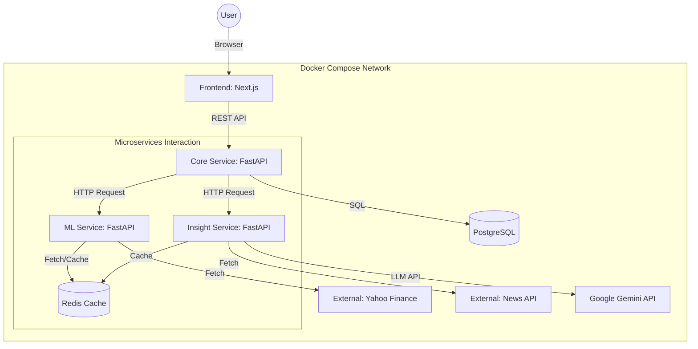

# AST-Web: Stock Trading Support System (Phase 2)

## 📖 プロジェクト概要
**AST-Web** は、作者が大学生時代にPython/Tkinterで開発した機械学習株式売買支援システム（Windowsアプリ）を、
モダンなWebアーキテクチャ（Cloud Native）へ移行・再構築するプロジェクトです。

本プロジェクトの目的は、単なるアプリのWeb化にとどまらず、**モノリスからマイクロサービスへの移行、コンテナオーケストレーション、GitOpsの実践** を通じて、堅牢かつスケーラブルなシステム基盤を構築するプロセスそのものを実証することにあります。

### 🔄 Phase 2: Microservices Refactoring
Phase 1では単一のコンテナで動作していたバックエンドを分割しました。
現在は **Core Service**（Web API・DB管理）と **ML Service**（数値計算・データ取得）によるマイクロサービス構成へ移行し、**Redis** によるキャッシュ戦略の導入を進めています。

---

## 📺 動作デモ
https://github.com/user-attachments/assets/aebab511-8a72-40bc-a618-5b65526c6fa3

---

## 🏗 アーキテクチャ (Phase 2)

**「責務の分離 (Separation of Concerns)」** を物理的なコンテナレベルで実現しました。
Webサーバーの応答性（Core）、重い機械学習処理（ML）、LLMを用いた定性インサイト生成（Insight）を分離することで、将来的なスケーラビリティを確保しています。


```mermaid
graph TD
    User((User)) -->|Browser| Front[Frontend: Next.js]
    
    subgraph "Docker Compose Network"
        Front -->|REST API| Core[Core Service: FastAPI]
        
        subgraph "Microservices Interaction"
            Core -->|HTTP Request| ML[ML Service: FastAPI]
            Core -->|HTTP Request| Insight[Insight Service: FastAPI]
            ML -->|Fetch/Cache| Redis[(Redis Cache)]
            Insight -->|Cache| Redis
        end
        
        Core -->|SQL| DB[(PostgreSQL)]
        ML -->|Fetch| Yahoo[External: Yahoo Finance]
        Insight -->|Fetch| NewsAPI[External: News API]
        Insight -->|LLM API| Gemini[Google Gemini API]
    end
```

### 採用技術スタック (Phase 2 Update)

| Category | Service | Tech Stack | Description |
| :--- | :--- | :--- | :--- |
| **Frontend** | **Web UI** | **Next.js (App Router)** | TypeScriptによる型安全性とコンポーネント指向UI。Phase 1から継続。 |
| **Backend** | **Core Service** | **FastAPI (Python)** | **Port: 8000**. API Gateway的役割。DB操作、ユーザーリクエストのハンドリングを担当。 |
| **Backend** | **ML Service** | **FastAPI (Python)** | **Port: 8001**. 計算・分析専用のマイクロサービス。XGBoostによる騰落予測を実行。 |
| **Backend** | **Insight Service** | **FastAPI (Python)** | **Port: 8002**. **New**. LLMを用いた定性インサイト生成。ニュース感情分析（`/insight/market`）とユーザー売買傾向分析（`/insight/behavior`）を担当。 |
| **Cache** | **Redis** | **Redis 7** | 株価データ・LLM分析結果のキャッシュ層。外部APIへの負荷軽減とレスポンス高速化を実現。 |
| **Database** | **DB** | **PostgreSQL 15** | 売買履歴、分析結果、銘柄情報の永続化。 |
| **Infra** | **Orchestration** | **Docker Compose** | 複数コンテナ (`stock-core`, `stock-ml`, `stock-insight`, `stock-db`, `redis`) の一括管理。 |

---

## 📂 ディレクトリ構成と役割

マイクロサービス化に伴い、ルート直下の構成を分割しましたが、Monorepo構成は維持しています。

```text
ast-web/
├── docker-compose.yml          # 全サービスのオーケストレーション定義
├── .github/workflows/
│   ├── test.yml                # CI: backend / ml / frontend の3並行ジョブ
│   └── deploy.yml              # Staging deploy (test.yml呼び出し + スタブstep)
│
├── backend/                    # [Core Service] 銘柄管理・DB操作・API Gateway
│   ├── main.py                 # エントリーポイント (Port 8000)
│   ├── schemas.py              # 共通データモデル (Pydantic)
│   ├── db/                     # DB接続・モデル定義
│   ├── routers/
│   │   ├── stocks.py           # 銘柄CRUD
│   │   ├── analysis.py         # 分析オーケストレーター (ML Service 呼び出し・売買判断)
│   │   ├── portfolio.py        # GET /api/portfolio: 保有銘柄の評価額・含み損益・配分集計
│   │   └── trades.py           # GET/POST /trades: 売買ログ・加重平均コスト法 / POST /settle: 全売却決済
│   └── tests/
│       ├── conftest.py         # SQLite in-memory DB fixture・TestClient DI
│       └── unit/
│           ├── test_stocks_router.py   # CRUD・バリデーション (26テスト)
│           ├── test_analysis_logic.py  # 売買判断ロジック全パターン (16テスト)
│           └── test_main.py            # アプリ起動・ヘルスチェック (2テスト)
│
├── backend-ml/                 # [ML Service] 計算・データ取得
│   ├── main.py                 # 分析APIエントリーポイント (Port 8001)
│   ├── services/
│   │   ├── market_data.py      # 株価データ取得 (yfinance・リトライ制御)
│   │   ├── ml_engine.py        # XGBoost による騰落予測
│   │   └── cache.py            # Redis キャッシュ (Graceful Degradation)
│   └── tests/
│       ├── conftest.py
│       └── unit/
│           ├── test_predict_endpoint.py # /predict エンドポイント全フロー (14テスト)
│           ├── test_ml_engine.py        # XGBoost予測ロジック (8テスト)
│           ├── test_market_data.py      # yfinanceラッパー (8テスト)
│           ├── test_cache.py            # Redis操作・障害時Degradation (15テスト)
│           └── test_main.py             # アプリ起動・ヘルスチェック (1テスト)
│
├── backend-insight/            # [Insight Service] LLMによる定性インサイト生成
│   ├── main.py                 # エントリーポイント (Port 8002) + CORSMiddleware
│   ├── routers/
│   │   └── market.py           # /insight/market/{symbol} ニュース感情分析 / /insight/market/{symbol}/cached キャッシュ確認専用
│   ├── schemas/
│   │   └── market.py           # InsightResponse / Article Pydantic モデル
│   ├── services/
│   │   ├── symbol_resolver.py  # 証券コード → 企業名変換 (yfinance)
│   │   ├── news_fetcher.py     # ニュース取得・前処理 (NewsAPI / httpx)
│   │   ├── llm_client.py       # Google Gemini 2.5 Flash ラッパー (google-genai SDK)
│   │   └── cache.py            # Redis キャッシュ TTL=3h・モジュールレベル接続プール (Graceful Degradation)
│   └── tests/
│       ├── conftest.py
│       └── unit/
│           ├── test_symbol_resolver.py  # yfinanceモック (4テスト)
│           ├── test_news_fetcher.py     # NewsAPIモック (10テスト)
│           ├── test_llm_client.py       # Geminiモック (9テスト)
│           ├── test_cache.py            # Redisモック (14テスト)
│           └── test_market_endpoint.py  # エンドポイント統合 (11テスト)
│
└── frontend/                   # [Frontend] Next.js アプリケーション
    ├── app/                    # App Router Pages
    ├── components/
    │   ├── StockTable.tsx           # 銘柄一覧 (行クリックでInsight取得・展開、保有株数±100・保有状況ドロップダウン、起動時キャッシュプリフェッチ)
    │   ├── PortfolioDashboard.tsx   # ポートフォリオサイドバー (総評価額・含み損益・SVGドーナツチャート・銘柄別配分バー)
    │   ├── NewsInsightPanel.tsx     # ニュース分析展開パネル (感情/サマリー/イベント/リスク)
    │   ├── SignalConvergenceBadge.tsx # XGBoost×Geminiシグナル収束バッジ
    │   ├── AnalysisPanel.tsx        # ML一括分析コントロール
    │   └── ...                      # その他共通コンポーネント
    ├── hooks/                  # useStocks カスタムフック
    ├── hooks/                  # useStocks / usePortfolio カスタムフック
    ├── lib/
    │   ├── api.ts              # APIクライアント (apiClient / getMarketInsight / getCachedInsight / getPortfolio / getTrades / addTrade)
    │   └── convergence.ts      # computeConvergence() ユーティリティ
    ├── types/                  # TypeScript型定義 (InsightResponse / ConvergenceState)
    └── __tests__/
        ├── page.test.tsx
        ├── components/
        │   ├── StockTable.test.tsx          # 銘柄行・Insight展開・BUY フォーム・取引履歴タブ (40テスト)
        │   ├── NewsInsightPanel.test.tsx    # 感情/メタ/イベント/リスク (12テスト)
        │   ├── SignalConvergenceBadge.test.tsx # 4状態 (4テスト)
        │   ├── AnalysisPanel.test.tsx
        │   ├── StockInputForm.test.tsx      # バリデーション・操作 (10テスト)
        │   ├── StatusLog.test.tsx
        │   └── ThemeToggle.test.tsx
        ├── hooks/
        │   └── useStocks.test.ts            # フックの状態管理 (12テスト)
        └── lib/
            ├── api.test.ts                  # apiClient + getMarketInsight (14テスト)
            └── convergence.test.ts          # computeConvergence 全分岐 (10テスト)
```

---

## 🚀 動作環境の構築 (Getting Started)

マイクロサービス構成のため、複数のコンテナが連携して動作します。

### 1. リポジトリのクローン
```bash
git clone https://github.com/[your-username]/ast-web.git
cd ast-web
```

### 2. コンテナの起動
以下のコマンドで、全サービス（Core, ML, DB, Redis）が一括起動します。
Phase 1のコンテナが残っている場合は、競合を避けるため `docker compose down` してから実行してください。

```bash
docker compose up --build
```

### 2.5. 環境変数の設定

```bash
cp .env.example .env
# .env を編集して以下の実値を設定:
#   POSTGRES_USER / POSTGRES_PASSWORD / POSTGRES_DB
#   GEMINI_API_KEY  — Google AI Studio (https://aistudio.google.com/) で取得
#   NEWSAPI_KEY     — NewsAPI (https://newsapi.org/register) で取得（無料枠: 100リクエスト/日）
```

### 3. アクセス
*   **Webアプリ**: [http://localhost:3000](http://localhost:3000)
*   **Core API Docs (Swagger UI)**: [http://localhost:8000/docs](http://localhost:8000/docs)
*   **ML API Docs (Swagger UI)**: [http://localhost:8001/docs](http://localhost:8001/docs)
*   **Insight API Docs (Swagger UI)**: [http://localhost:8002/docs](http://localhost:8002/docs)

### 4. 動作確認
Webアプリ上で「一括分析」ボタンを押すと、Frontend -> Core -> ML -> Core -> DB -> Frontend のフローでデータが流れ、ログパネルに連携状況が表示されます。

### 5. テストの実行

各サービスのテストは Docker 不要でローカル実行できます。

```bash
# Core Service (SQLiteで外部DB不要)
DATABASE_URL="sqlite:///./test.db" pytest backend/tests/ -v

# ML Service
pytest backend-ml/tests/ -v

# Insight Service
pytest backend-insight/tests/ -v

# Frontend
cd frontend && npm test
```

---

## ✨ 実装済み機能 (Phase 2 Update)

1.  **マイクロサービス連携**
    *   **Core Service**: ユーザー管理、保有銘柄のCRUD、売買判断の最終決定。
    *   **ML Service**: 株価データの取得、XGBoostによる騰落予測。
    *   **Insight Service**: NewsAPI によるニュース取得 → Google Gemini 2.5 Flash による感情分析 → JSON構造化出力。
    *   **連携ログ**: フロントエンド上で「CoreからMLへリクエスト送信中...」といった詳細な処理状況を可視化。
2.  **デュアルシグナルUI**
    *   銘柄行をクリックすると Insight Service からニュース感情を取得・展開表示。再展開のたびに再フェッチし Redis キャッシュ状態（`(キャッシュ)` ラベル）を正確に反映。
    *   XGBoost予測（up/down）と Gemini感情（positive/negative/neutral）を並列表示し、**シグナル収束状態**（bullish / bearish / divergent / no_data）をバッジで示す。
    *   ページ読み込み時に全銘柄の `/cached` エンドポイントを並列プリフェッチ。Redis 済みの銘柄はクリック前からニュースカラムに感情バッジを即時表示。
    *   売買の最終判断はユーザーが行う。システムは両シグナルを提示するのみ。
3.  **ポートフォリオ管理 (Phase 3.1 Week 1)**
    *   `StockInTrade` に `shares_held`（保有株数）カラム追加。`ALTER TABLE ... ADD COLUMN IF NOT EXISTS` による Alembic 不要のスタートアップマイグレーション。
    *   `GET /api/portfolio`: `shares_held > 0` の銘柄を集計し、総評価額・含み損益・銘柄別配分（%）を返す。
    *   UIに保有状況ドロップダウン（未保有/保有済）と保有株数±100株コントロールを追加。未保有→保有済で `order_id` を `MANUAL` に切り替え、AI が SELL/HOLD ロジックへ移行。
4.  **データ整合性の向上**
    *   **浮動小数点数対策**: バックエンド/フロントエンド双方で適切な丸め処理を行い、正確な価格情報を表示・保存。
    *   **JST時刻**: Docker コンテナの UTC タイムゾーンを補正。`datetime.now(timezone.utc).replace(tzinfo=None) + timedelta(hours=9)` でナイーブ JST を生成し、DB の naive datetime と混在エラーを回避。
5.  **パフォーマンス最適化**
    *   **Redisキャッシュ**: ML 予測結果・Insight 分析結果をキャッシュ（Insight: TTL 3時間）。外部 API コストを削減し、2回目以降は即時返却。Redis 障害時も Graceful Degradation で継続動作。
    *   **接続プール**: Insight Service の Redis クライアントをリクエスト単位の新規接続からモジュールレベルの `ConnectionPool` に変更。起動時に1度だけ疎通確認し、以降はプールから再利用。
    *   **キャッシュ確認専用エンドポイント** `GET /insight/market/{symbol}/cached`: LLM 分析を実行せず Redis の有無だけを返す。プリフェッチ用に特化したエンドポイント。
6.  **本番対応 CORS 設定**
    *   `ALLOWED_ORIGINS` 環境変数でオリジンを注入。`docker-compose.yml` で開発用デフォルト `http://localhost:3000` を設定。本番では環境変数上書きのみで対応可能。

---

## 🧪 テスト戦略 & 品質保証ロードマップ

### 設計思想: MECE なテストケース網羅

テストケース設計において **MECE (Mutually Exclusive, Collectively Exhaustive)** を原則とし、「漏れなし・重複なし」の網羅性を定量的に追求しています。

網羅性を測る指標は3階層で捉えています。

| 指標 | 何を測るか | 本プロジェクトでの位置づけ |
| :--- | :--- | :--- |
| **Line Coverage** | 実行された行の割合 | ベースライン確認 |
| **Branch Coverage** | if/else 全分岐の検証 | 主要KPI（現在測定中） |
| **Mutation Testing** | バグを埋め込んでテストが検知できるか | **Phase D で導入済み** |

Branch Coverage が Line Coverage より厳しい理由: `if A and B:` という1行コードでも「A=True/B=False」「A=False/B=True」など分岐ごとにテストが要求されます。行が実行されただけではロジックの正確性は保証されません。

Mutation Testing が Branch Coverage より厳しい理由: `if x > 0` を `if x >= 0` に書き換えても行も分岐も通過する。テストが境界値を正確に検証していなければ mutation は生き残る（survive）。

---

### 現在のテスト構成（268テスト）

| サービス | テストファイル | テスト数 | Line Coverage | Branch Coverage | Mutation Score |
| :--- | :--- | :---: | :---: | :---: | :---: |
| **Core Service** | `test_stocks_router.py` / `test_analysis_logic.py` / `test_main.py` | 44 | 99% | **99%** | — |
| **ML Service** | `test_predict_endpoint.py` / `test_ml_engine.py` / `test_market_data.py` / `test_cache.py` / `test_main.py` | 46 | **100%** | **100%** | — |
| **Insight Service** | `test_symbol_resolver.py` / `test_news_fetcher.py` / `test_llm_client.py` / `test_cache.py` / `test_market_endpoint.py` | 48 | — | — | — |
| **Frontend** | `StockTable.test.tsx` / `NewsInsightPanel.test.tsx` / `SignalConvergenceBadge.test.tsx` / `convergence.test.ts` / `api.test.ts` / `useStocks.test.ts` / その他 | 130 | 87% | **95%** | **60%** |

---

### テスト設計の技術的ポイント

**Core Service (pytest)**

- テスト専用 SQLite in-memory DB を使用し、外部 PostgreSQL なしで CI 実行可能
- `conftest.py` でトランザクション単位のロールバック fixture を実装 → テスト間の状態汚染ゼロ
- `_insert_stock()` ヘルパーで DB に直接テストデータを挿入し、API 経由で状態変化を検証
- `yfinance` / `httpx` (ML Service 間通信) を `unittest.mock` でモック化し、純粋なビジネスロジックを隔離
- async context manager (`async with httpx.AsyncClient()`) のモックパターンを実装

```
Core Service の DB 例外ブランチカバー例:
  create_stock:  db.commit() 失敗 → rollback + 400 エラー
  delete_stock:  db.commit() 失敗 → rollback + 400 エラー
  update_stock:  db.commit() 失敗 → rollback + 400 エラー
  update_stock:  Pydantic V2 model_dump() → AttributeError → V1 dict() フォールバック
  analyze_stock: db.commit() 失敗 → rollback + 500 エラー
  check_repurchase_prohibition: 売却日時フォーマット不正 → ValueError を握り潰し False を返却
```

```
売買判断ロジックの全分岐カバー例:
  未保有 × 上昇予測  → BUY
  未保有 × 下落予測  → STAY
  保有中 × 上昇予測  → HOLD
  保有中 × 下落予測  → SELL
  売却済3日以内 × 上昇予測 → WAIT  ← 再購入禁止期間ロジック
  売却済4日後   × 上昇予測 → BUY   ← 禁止期間外
```

**ML Service (pytest)**

- yfinance・Redis を全モック化 → ネットワーク通信なしで完全再現性
- XGBoost 予測テストは実際のモデル学習を実行しつつ純粋関数として検証
  - 純粋上昇/下降トレンドだと `y_train` が単一クラスになり `XGBClassifier` が `ValueError` を投げる問題を特定し、トレンド内に意図的な逆方向日を挿入するテストデータ設計で解決
- Graceful Degradation を明示的にテスト: Redis 障害時に例外を上位に伝播させないことを verify

```
キャッシュの全ケースカバー例:
  _get_client: 接続成功 / from_url例外 / ping例外
  get_prediction: HIT / MISS / Redis停止 / GET例外 / JSONデシリアライズ正確性
  set_prediction: key形式 / TTL定数 / JSON直列化 / Redis停止 / SET例外
```

**Frontend (Jest + React Testing Library + Stryker)**

- `@testing-library/react` の `renderHook` / `fireEvent` / `waitFor` を活用
- `apiClient` をモック化しネットワーク不要なオフライン実行
- カスタムフック `useStocks` を Presentation Component から独立させ単体テスト
- バリデーションロジック（空入力・英字入力・API失敗後の入力フォーム非クリア）を網羅
- `next-themes` をモック化し `ThemeToggle` の dark/light 両分岐を検証
- **Stryker Mutation Testing** 導入: 310 mutant を生成し mutation score **60%** を計測・可視化

```
ThemeToggle の全分岐カバー例:
  theme="light" → 太陽アイコン表示 / click → setTheme("dark")
  theme="dark"  → 月アイコン表示   / click → setTheme("light")
```

```
StockTable の全分岐カバー例:
  loading=true / stocks=0 件  → ローディング表示
  loading=true / stocks=1 件+ → テーブル表示（early return をすり抜ける境界ケース）
  ai_prediction: "up" / "down" / null
  ai_suggestion: BUY(赤) / SELL(緑) / WAIT(黄) / その他(グレー) / null
  current_price: 値あり → "¥{price}" / null → "---"
  order_datetime: "未取得" → "未保有" / それ以外 → 日時表示

AnalysisPanel の全分岐カバー例:
  stocks=0 件  → ボタン disabled
  stocks=1 件+ → ボタン enabled / 分析中は「連携処理中...」+ プログレスバー表示
  API 成功     → current_price を toFixed(1) でフォーマットしてログ出力
  API 例外     → [Error] ログ / onAnalysisComplete は例外後も必ず呼ばれること
```

---

### 品質向上ロードマップ

| Phase | 対象 | 追加テスト数 | カバレッジ目標 | 状態 |
| :--- | :--- | :---: | :--- | :---: |
| **Phase A** | ML Service: `/predict` エンドポイント全フロー + Redis キャッシュ全操作 | +29 | ML: 78% → **100%** | ✅ 完了 |
| **Phase B** | Frontend: `StockTable` / `AnalysisPanel` / `StatusLog` コンポーネント | +42 | Frontend: 37% → **85%**（目標 65% を大幅超過） | ✅ 完了 |
| **Phase C** | Core Service: `crud.py` / `analysis.py` の Branch Coverage 補完 | +6 | Core: 96% → **99%**（目標 98% 超過） | ✅ 完了 |
| **Phase D** | Frontend: `ThemeToggle` + Stryker / mutmut Mutation Testing 導入 | +5 | Frontend: 85% → **95%** / Mutation Score: **60%** | ✅ 完了 |

### Mutation Testing の詳細

**Frontend: Stryker**

Branch Coverage が「コードが実行されたか」を測るのに対し、Mutation Testing は「テストがコードの**意図**を正確に検証しているか」を測る。
Stryker は元のコードに微小な変異（演算子変更・条件反転・定数書き換え等）を 310 個注入し、テストが変異を検知（kill）できるかを確認する。

```
# 実行コマンド (frontend/ から)
npm run test:mutation
# → reports/mutation/html/index.html に詳細レポートを出力
```

**Stryker 初回計測結果 (2026-05-14)**

| ファイル | Killed | Survived | Mutation Score |
| :--- | :---: | :---: | :---: |
| `useStocks.ts` | 42 | 7 | **85.7%** ← 最高品質 |
| `lib/api.ts` | 15 | 5 | **75.0%** |
| `ThemeToggle.tsx` | 18 | 8 | **69.2%** |
| `StockTable.tsx` | 44 | 27 | **62.0%** |
| `AnalysisPanel.tsx` | 27 | 23 | **54.0%** |
| `StatusLog.tsx` | 5 | 5 | **50.0%** |
| `StockInputForm.tsx` | 36 | 48 | **42.9%** |
| **合計** | **187** | **123** | **60.3%** |

Survived mutant の主な原因: 文字列リテラル変異（日本語テキストの変異はテストが `.toContain` で部分一致検証のため生き残る）。`toEqual` での完全一致に強化することで mutation score 向上が見込まれる。

**Python: mutmut**

```bash
# インストール
pyenv exec pip install mutmut

# 実行コマンド (リポジトリルートから)
pyenv exec mutmut run
pyenv exec mutmut results
```

設定ファイル: `pyproject.toml` (`paths_to_mutate = "backend-ml/services/"`)

---

## 🗺 ロードマップ

本プロジェクトは段階的な進化を予定しています。

*   **Phase 1: Monolithic MVP (Completed)**
    *   [x] PythonデスクトップアプリのWeb API化 (FastAPI)
    *   [x] Next.jsによるモダンUI構築
    *   [x] Docker Composeによるフルスタック開発環境
*   **Phase 2: Microservices & Optimization (Completed)**
    *   [x] バックエンドの分割 (Core Service / ML Service)
    *   [x] サービス間通信の実装 (HTTPX)
    *   [x] Redisによるキャッシュ層の導入 (Rate Limit回避・高速化)
    *   [x] GitHub Actions CI の構築 (3並行ジョブ)
    *   [x] Insight Service 構築: ニュース感情分析 (`/insight/market`) 実装完了（Google Gemini 2.5 Flash + NewsAPI）
*   **Quality: テストカバレッジ向上プロジェクト (Completed)**
    *   [x] Phase A: ML Service 全テスト (100% branch coverage 達成)
    *   [x] Phase B: Frontend コンポーネントテスト (branch coverage 85% 達成)
    *   [x] Phase C: Core Service branch coverage 補完 (99% 達成)
    *   [x] Phase D: ThemeToggle テスト + Stryker / mutmut 導入（mutation score 60% 計測）
*   **Phase 3: Cloud Native & GitOps (Planned)**
    *   [ ] Kubernetes (EKS/GKE) へのデプロイ
    *   [ ] ArgoCDによるGitOpsフローの構築
    *   [ ] サービスメッシュ (Istio) による可観測性向上
*   **Phase 3.1: ポートフォリオ視点への進化 (In Progress)**

    既存資産（ML / Insight Service）を壊さず、その上に「資産形成」レイヤーを被せる方針。
    1か月・個人開発ペースを想定した週次分解。

    **Week 1 — データモデル修正（土台）✅ Completed**
    *   [x] `StockInTrade` に `shares_held`（保有株数）カラム追加、スタートアップマイグレーション
    *   [x] Core Service に `GET /api/portfolio` を新設：全銘柄の `shares_held × current_price` を合算し、総評価額・銘柄別配分（%）・含み損益を返す
    *   [x] UI に保有状況ドロップダウン・保有株数±100コントロール追加、Insight Redis キャッシュ改善（接続プール・プリフェッチ・`/cached` エンドポイント）

    **Week 2a — ポートフォリオダッシュボード（可視化）✅ Completed**
    *   [x] メインページ右カラムに `PortfolioDashboard` を追加（SPA 構成維持、別ルート不要と判断）：総評価額・含み損益・SVGドーナツチャート・銘柄別配分バー
    *   [x] `usePortfolio` フック新設：`GET /api/portfolio` を管理し手動 refresh を提供
    *   [x] 保有株数変更・保有状況変更・一括分析完了のタイミングでポートフォリオを自動更新
    *   [x] コンテナ幅を `max-w-screen-2xl`（1536px）に拡張し左カラムの横幅を確保
    *   既存の `NewsInsightPanel` / `computeConvergence` はそのまま個別銘柄詳細として活用（作り直し不要）

    **Week 2b — 取得株価管理 + 売買ログ ✅ Completed**
    *   [x] **DB追加**: `trade_history` テーブル新設（`Base.metadata.create_all` によるスタートアップ自動作成）
        - `id` (PK autoincrement) / `stock_symbol` (indexed) / `trade_type` ("BUY"|"SELL") / `quantity` / `price` / `trade_datetime` / `note`
    *   [x] **Backend**: `TradeHistory` SQLAlchemy モデル・`TradeCreate`/`TradeResponse` Pydantic スキーマ追加
    *   [x] **Backend**: `GET /api/stocks/{symbol}/trades` — 取引履歴を新しい順に取得
    *   [x] **Backend**: `POST /api/stocks/{symbol}/trades` — BUY/SELL 記録追加 → 加重平均コスト法で `average_acquisition_price` を再計算・`StockInTrade` に同期
    *   [x] **Backend**: `POST /api/stocks/{symbol}/settle` — DB から現在の `shares_held` / `current_price` を参照して SELL ログを自動記録し、`order_id`/`shares_held`/`average_acquisition_price` を一括リセット
    *   [x] **Frontend**: `StockTable` に「取得株価(均)」「含み損益」カラム追加（日本株慣例: 含み益=赤・含み損=緑）
    *   [x] **Frontend**: 「未保有→保有済」切替時にインラインフォーム（単価・株数）を展開し BUY として記録
    *   [x] **Frontend**: 行展開エリアに「ニュース感情」「取引履歴」タブを追加（クリック時に `GET /trades` を遅延取得）

    **Week 3 — ゴールベース積立シミュレーター**
    *   [ ] Core Service に追加（あるいは軽量新規サービス）：目標金額・期間・想定利回りを入力 → 必要月次積立額を複利計算で逆算する API
    *   [ ] フロントに簡易フォーム＋結果表示（グラフ化は任意）
    *   ここで初めて「短期シグナル」と「長期ゴール」が同一画面に並び、思想の矛盾を製品として解消できる。

    **Week 4 — NISA枠トラッキング + Quality負債の返済**
    *   [ ] 年間つみたて投資枠・成長投資枠の消化額を手動記録し、残枠を表示（外部API連携不要）
    *   [ ] Insight Service に CI ジョブを追加（Week 1〜3 の新規コードのテストも含めて一括整備）
    *   [ ] README を Phase 2/3 の実態に合わせて更新（技術的負債の解消）

---

## 👤 Author
*   **Role**: Infrastructure Engineer / Aspiring Web Developer
*   **Focus**: Cloud Native, DevOps, SRE
